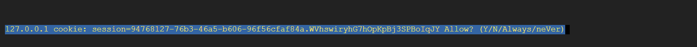

## airflow使用說明(docker)
## 安裝 
首先先用docker-compose.yml 執行 docker  compose up -d
安裝完成後就會有一個完全空殼的airflow 裡面只有一個DAGS

## 設定
剛創好的沒有帳號密碼所以要進入容器
```
docker exec -it  airflow_docker-airflow-1 /bin/bash 
```

加入一個帳號密碼 airflow:airflow
```
airflow users create
--username airflow
--firstname XXXX
--lastname XXXX
--role Admin
--email XXXXX
```
XXX隨意輸入

ctrl+d 退出容器

## 變數設定
預設DAGS中有一個設定http_default 要額外設定


## 確認好網路關係
```
docker network ls
```

## 建立好連線network
```
sudo docker network connect link_out dbt_fastAPI
```

!這裡發現特別的狀況 正常會由docker 自動創建DNS 彼此只要使用容器名稱就能互通 但這次部屬就發現沒有自動生成


## 確認好連線
```
docker inspect dbt_fastAPI 
```
若docker有自動生成DNS那連接的IP就用容器名如果沒有就使用IP

```
...
"link_out": {
                    "IPAMConfig": {},
                    "Links": null,
                    "Aliases": [
                        "7946a7f9948f"
                    ],
                    "NetworkID": "eb3bb827a15bd3b3faca2edc7a07dfc8a901e5b8e9ec006993feed20464a274e",
                    "EndpointID": "01fda1e6cf21912d2a8f1c37b05f19941350f0cb7e81d76642e5273cc1479673",
                    "Gateway": "172.20.0.1",    <<<<對其他台的gateway所以用這個
                    "IPAddress": "172.20.0.2",
                    "IPPrefixLen": 16,
                    "IPv6Gateway": "",
                    "GlobalIPv6Address": "",
                    "GlobalIPv6PrefixLen": 0,
                    "MacAddress": "02:42:ac:14:00:02",
                    "DriverOpts": {}
                }
            }
        }
    }
]
```

這裡就要進到瀏覽器內設定
這裡使用lynx
```
lynx 127.0.0.1:5555
```

cookie都Y


登入


先設定連線


http_default選edit(上方)


填入host跟port然後save

這樣http_default就能用了 任何DAGS使用都會自動帶入(範例帶:172.20.0.1:8090)

## 執行

回到dags


選擇好預設的


Trigger DAG! 啟動他

## 檢查
可以從2個方向
1. 回airflow容器<br>
 airflow dags list-runs -d api_pass_dag
 <br> 直接確定有沒有執行成功
 
2. 直接映出被呼叫的api<br>
 docker  logs <your_container>
 ```
 [felix_lu@imgenie-dbt local]$ docker  logs dbt_fastAPI
INFO:     Started server process [1]
INFO:     Waiting for application startup.
INFO:     Application startup complete.
INFO:     Uvicorn running on http://0.0.0.0:8080 (Press CTRL+C to quit)
Blob download/response.json downloaded from test_buckets001/DBT.
Blob download/response5.json downloaded from test_buckets001/DBT.
Blob download/response6.json downloaded from test_buckets001/DBT.
Blob download/responseA.json downloaded from test_buckets001/DBT.
Blob download/responseB.json downloaded from test_buckets001/DBT.
Blob download/response中文測試.json downloaded from test_buckets001/DBT.
INFO:     172.17.0.1:42966 - "POST /work01 HTTP/1.1" 200 OK
 ```
 <br> 可以看被呼叫的狀況