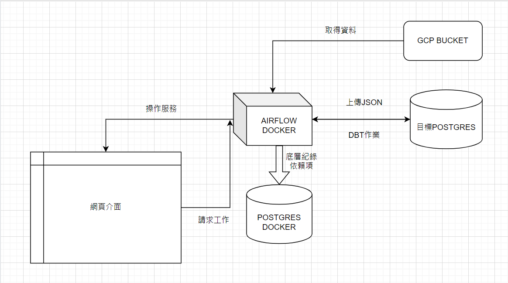
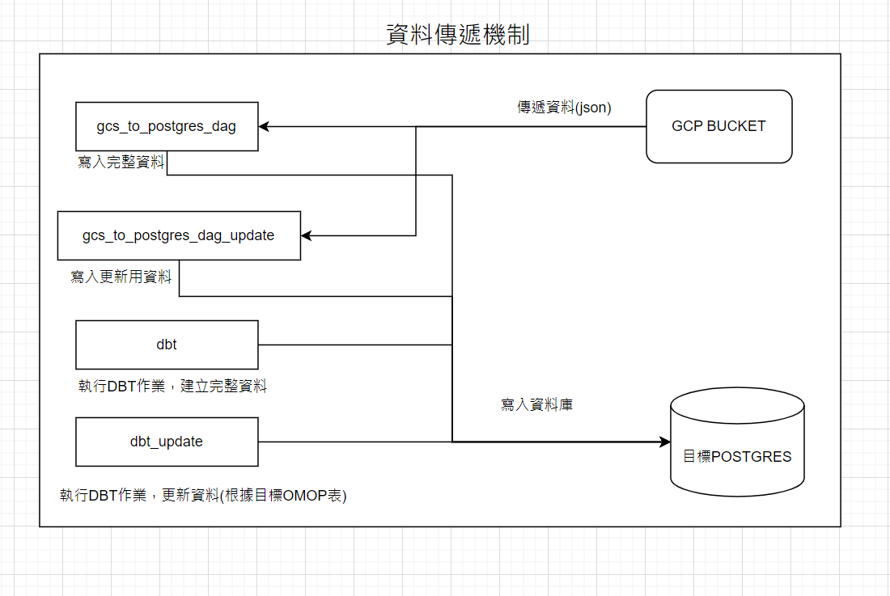
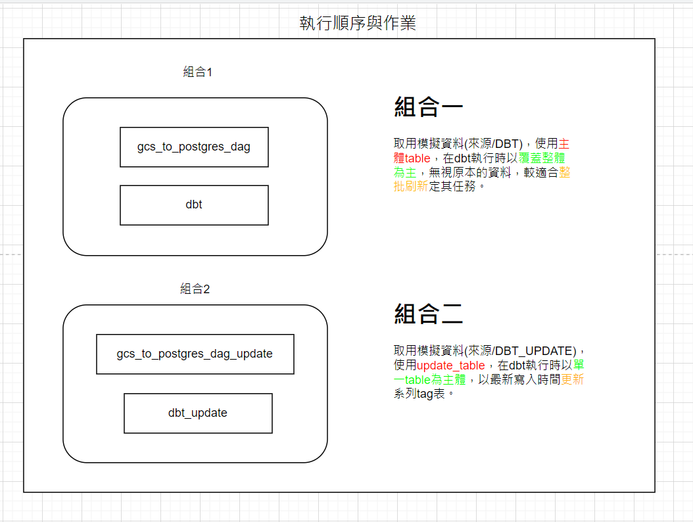
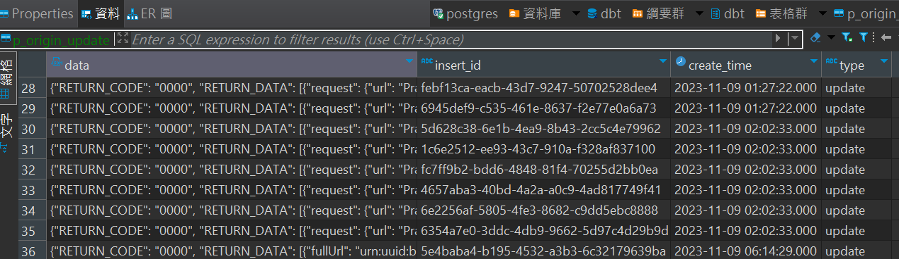

# airflow 總說明

## 流程圖
### 整體流程


### DAG流程


### 資料組合


## 手動參數說明
### 連線數據
連線資訊 建立時請用下列名稱但可從[docker-compose.yml](docker-compose.yml)修改
  - postgres連線資訊 postgres_conn (預設名稱 psql_link)
  - gcp連線json google_cloud_storage_conn (預設名稱 gcp_credentials)
  
<br>[admin >> connection]

Variable 設定 <br>
dbt run --select tag:{OMOP表名} 使用omop_table_name (目前不可取代)
<br>[admin >> variable]

<br>詳細設定可參考[說明](說明.md)

## 整體使用說明
### 啟動服務
第一步:
將此文件包([docker-compose.yml](docker-compose.yml)位置)執行

<br>裝置指令
```
docker compose up --build -d
```
如果發生異常或大型修改使用
<br>解除指令
```
docker compose down -v
```
正常情況下airflow在docker-compose時會自動把背景服務連上同步容器postgres這樣的服務也比較能持續，也能控制容量與查找錯誤。

第二步
完成後要進入網頁介面請在瀏覽器上連線
```
http://127.0.0.1:5555/home
```
再進去後會遇到登入頁面

要開一個指令視窗進入容器
```
docker exec -it airflow_docker-airflow-1 bash
```
可以ls看到有個檔案standalone_admin_password.txt
```
cat standalone_admin_password.txt
```
可以看到admin密碼
登入用帳號admin貨是自己創建帳號(需要重新啟動服務才會生效)
```
airflow users create --username airflow --firstname airflow --lastname airflow --role Admin --email airflow@gmail.com
```

第三步
設定connection
詳細[說明](說明.md)內圖參考
要注意以下幾點
1. host.docker.internal 是你的本機IP的意思如果要用proxy連線會設定這個IP
2. 檔案通常不建議留機器內 所以建議用Credential Configuration File
3. 名稱可以在[docker_compose.yml](docker-compose.yml)自訂但同時設定connection名稱時要一致
4. 名稱如果手動修改要改docker內部參數同時要考慮重啟可能會恢復

## 更新機制說明
### 基礎資料表
1. (測試資料使用同個bucket但不同資料夾並資料有稍微修改)
2. 表名p_origin_update有與批量更新p_origin作區別，並保留特殊欄位type用以擴充功能以及做出區別

3. row_data的部分因可能重複執行會干擾批次所以獨立一張row_data_update也讓表能保持單張輸出入的方式
4. 執行時使用單張tag的方式只要是相關的上游會自動執行(row_data_update每次執行都會被刷新確保資料最新)使用的格式是
```
dbt run --select tag:{OMOP表名}
```
5. OMOP表名設定在variable的部分使用固定key  {omop_table_name} 值為任一OMOP表名 執行的時候會跑row_data_update >> 他的上游view >> 當張表
能做到當張更新部分更新的方式


## 疑難排除
如果有出現名稱問題通常是名字的部分優先先檢查 [手動參數說明] 的部分

連線問題要確認
 1. proxy有沒有連上
 2. IP是否正確 (使用proxy 通常用 host.docker.internal server端則用內部連線IP)
 3. port是否正確
 4. 帳號密碼是否正確
 5. docker的容器是否改過名字(可能為自動修改需檢查連線設定如果為連線docker的postgres可以參考[airflow.cfg](airflow.cfg))的sql_alchemy_conn跟celery_result_backend

啟動後沒有安裝套件導致DAG錯誤 可能為work還有殘留檔案.init 刪除重開容器就可以

如果有檔案沒有權限 通常是需要chmod 檔案權限來解決
在 iOS 中，應用程式的權限和文件管理受到蘋果的限制，所以無法像在 Docker 或類似的環境中使用 chmod 命令來直接更改檔案權限。

如果你是 iOS 應用程式的開發者，可以透過 NSFileManager 類別提供的方法來管理應用程式內部的檔案權限。你可以使用這些方法來設置檔案的屬性，例如檔案的讀取、寫入權限等。

目前解決方法   git config core.sharedRepository all 
這個指令是用來設定 Git 儲存庫（repository）的共享權限。設定 core.sharedRepository 為 all 會將儲存庫中的所有檔案及目錄設定為可共享。這表示儲存庫中的所有使用者（群組成員）都將具有對檔案和目錄的讀寫權限，而不只是創建這些檔案的原始使用者。

當你設定了這個選項後，對於新建的檔案和目錄，Git 會確保它們具有適當的權限，使所有群組成員都能夠共享、編輯和提交這些檔案。這在協作開發的情況下可能很有用，特別是當多個使用者需要對同一個儲存庫進行更改和提交時。 