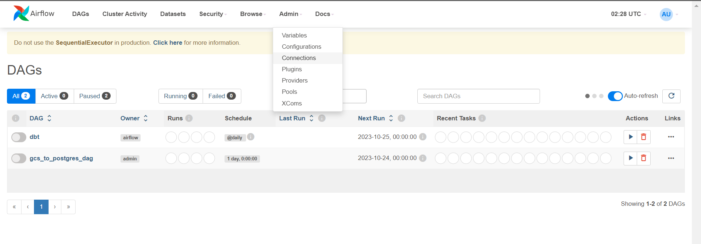
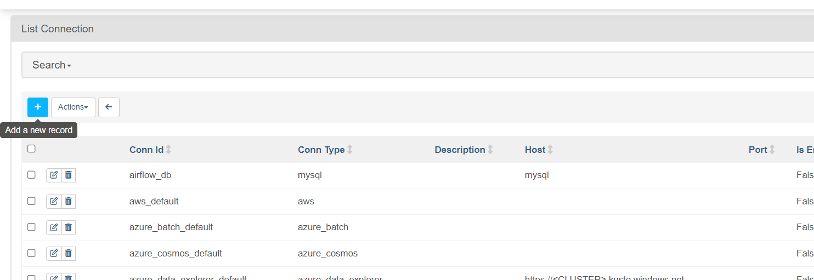
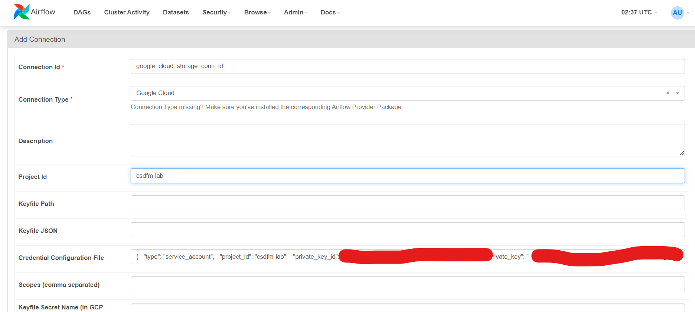
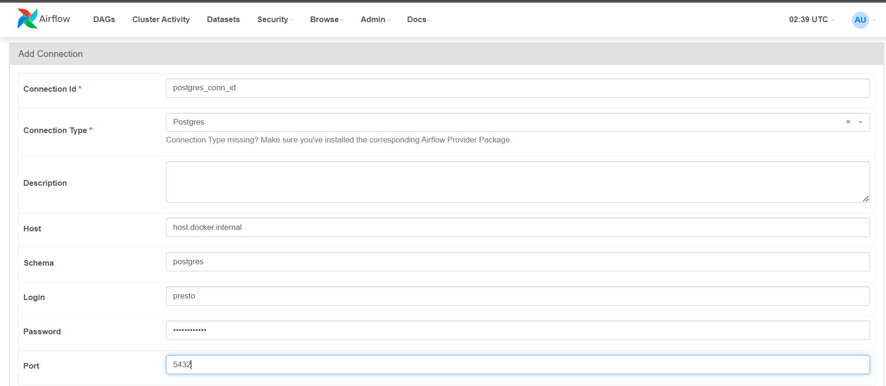
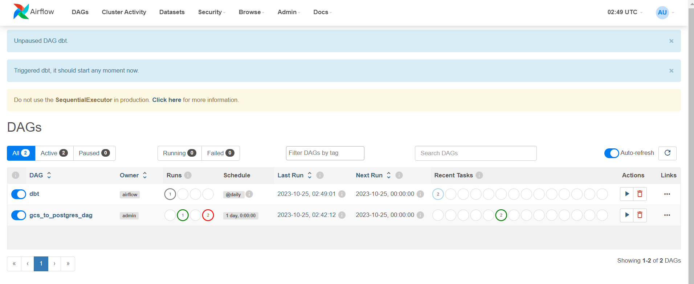
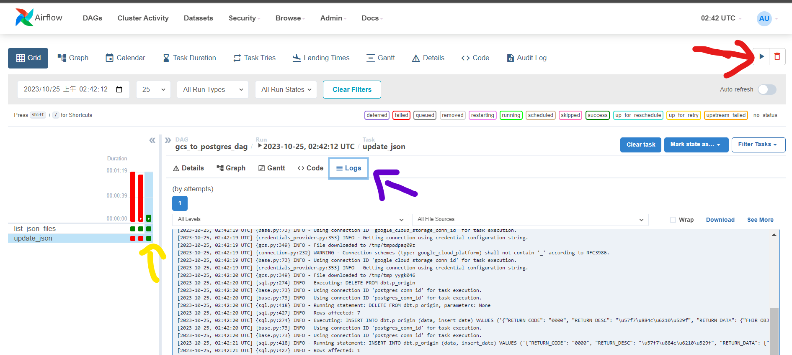

# airflow安裝說明
## 開始注意
1. work/.init若存在，不會安裝套件必定錯誤
2. 剛建好的帳號是admin，密碼會在exec的standalone_admin_password.txt 也能自己新增
```
airflow users create --username airflow --firstname airflow --lastname airflow --role Admin --email airflow@gmail.com
```
3. 必須建立連線
psql_link
gcp_credentials
方式如下





## DAG
有兩階段


### gcs_to_postgres_dag
將gcp bucket的json丟到db的p_origin內
### dbt
執行dbt

## 直接執行
紅:執行
黃:選擇執行階段
藍:logs可以看到執行內容

