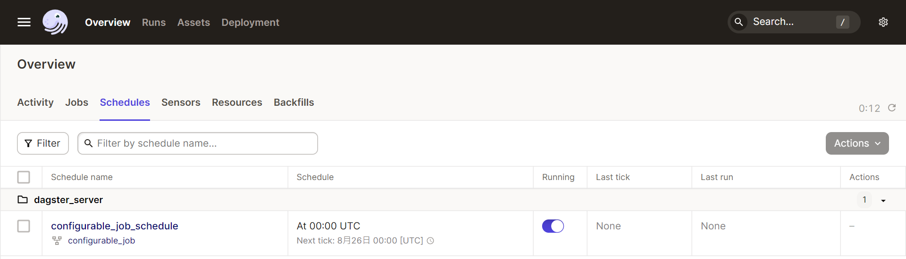

# dagster說明
## 安裝
pip3 install dagster  dagit dagster-dbt
並且dbt功能也都要有裝好

## 創建
```
dagster project scaffold --name dagster_server
```

在dagster_server/在dagster_server下

1. 新增[mydag.py](./dagster_server/mydag.py)
   已設定為執行dbt run功能

2. 設定[__init__.py](./dagster_server/__init__.py)
   defs 參數下 Definitions增加jobs

設定參數
```
$env:DAGSTER_HOME = "...\Dagster_server" 
```
linux用 export $DAGSTER_HOME=...

單支測試
dagit -f .\Dagster_server\mydag.py

整個服務
dagster dev

網頁
Deployment/dagster_server 底下

進入


圖形


生成自動預設文件


要改成DBT用的位置


執行按鈕


自動跳到RUN


還有執行紀錄

使用ASSETS設定
根據init預設會載入


還有紀錄


圖形


使用Schedule設定
使用在[schedules.py](./dagster_server/schedules.py)



在job上增加@schedule設定也能發揮作用不過要到[__init__.py](./dagster_server/__init__.py)修改


完整功能<br>
使用[api_link.py](./dagster_server/api_link.py) (以目前版本沒有順序)<br>
安排3個op<br>
call_api_op 跑<your_ip>:<your_port>/test<br>
call_api_op2 跑<your_ip>:<your_port>/bucket_to_db<br>
call_api_op3 跑<your_ip>:<your_port>/dbt_exec<br>

<br>
參考:[網址](https://wdxtub.com/bigdata/bigdata-03/2023/06/16/)
