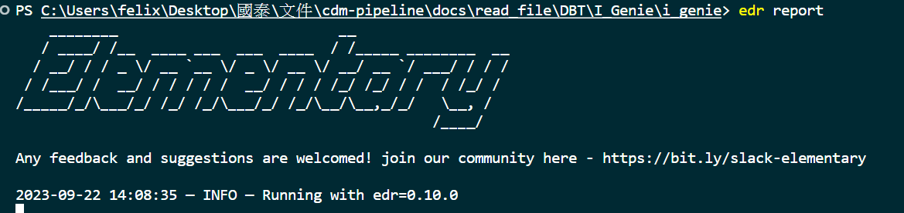
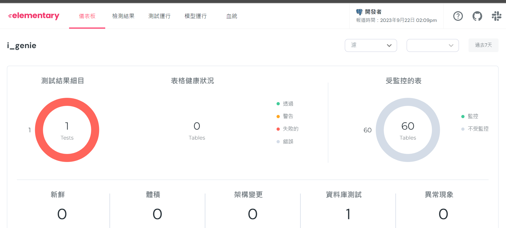
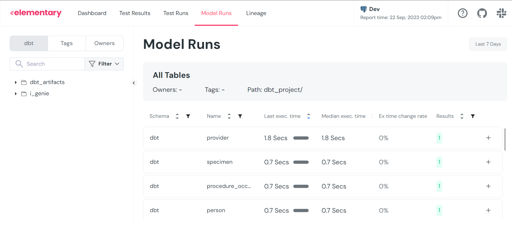
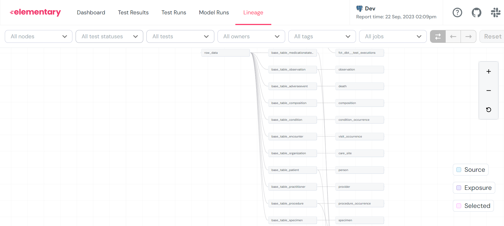

# 文書工具使用說明

## 前置動作
dbt run
dbt test

## elementary
可先參考[elementary](./edr說明.md)安裝
將所有配置好後可以看到介面又或者直接打開[edr_target](./edr_target/elementary_report.html)
在run時就能把表配置好，他是一個檔案所以不用特別處裡只要打開或啟動服務掛著

### 圖示

## dbt_artifacts
在run時就能把表配置好
### 生成資訊
dbt docs generate
### 掛上服務 
dbt docs serve 

### 圖示

