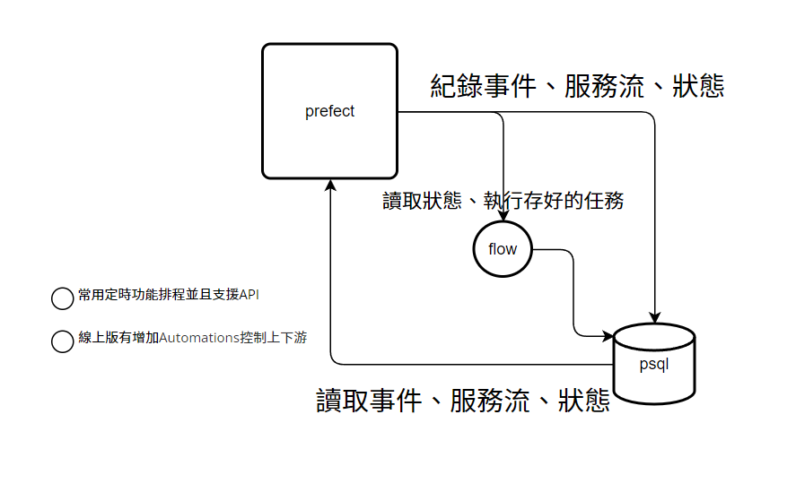

# 控流說明


   
## 有三種方式控制資料更新目前分為

### 定時
最基礎的手法，目前使用的方式時間到就會跑，介面可手動修改

### 上下游
Automations可以設定達成特定條件時啟動，程式內碼可以已同一個flow的方式直接串task一次完成
但分不同的flow便只能使用Automations，但Automations只有cloud才能使用，或許未來的版本可能加入。

### API呼叫
API介面為 服務網址/docs 以下是手動呼叫

id取得: (現使用 "a536155b-01da-43d3-80e0-d7b1c25e76eb" 為伺服器GCPbucket測試id )


以Deployments id指定
```
curl -X POST -H 'Content-Type: application/json' \
http://127.0.0.1:4200/api/deployments/a536155b-01da-43d3-80e0-d7b1c25e76eb/create_flow_run \
-d '{"name": "curl", "state": {"type": "SCHEDULED"}}'
```

## 檔案說明
1. get_json_with_GCPbucket - 把json轉到db
2. trigger_dbt_flow - 執行dbt